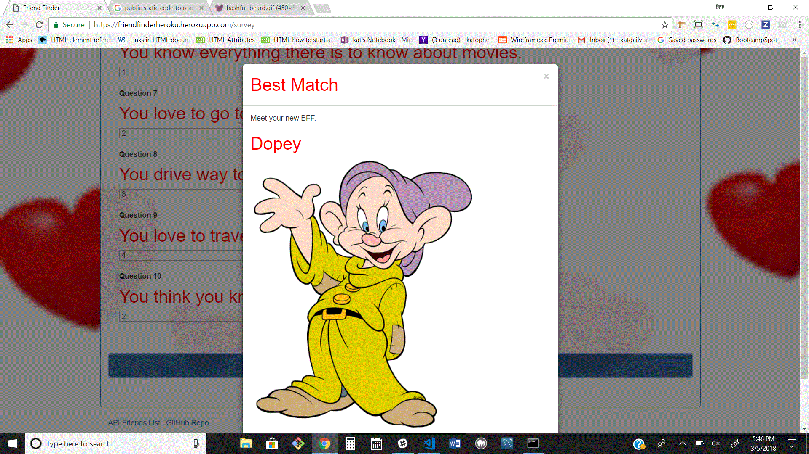

 ## FriendFinder

## Overview
FriendFinder is a web application designed to find the perfect match.

# Utilising
* Node.js
* Express
* Body-Parser
* Various Routes
* API

# Using FriendFinder
Users can click the blue 'Go to Survey' button and then answer 10 questions. After answering the questions the app will calculate the differences in answers between the user and all Friends - then return the friend with the closest scores.

 This app is setup to listen on a Heroku default port.

 https://friendfinderheroku.herokuapp.com/

 